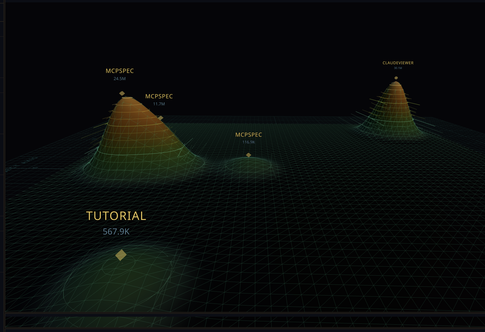

<p align="center">
  
</p>

<h1 align="center">Strata</h1>

<p align="center">
  <strong>A 3D topographic dashboard for your Claude Code sessions.</strong>
</p>

<p align="center">
  <a href="#features">Features</a> &bull;
  <a href="#quick-start">Quick Start</a> &bull;
  <a href="#how-it-works">How It Works</a> &bull;
  <a href="#tech-stack">Tech Stack</a> &bull;
  <a href="#keyboard-shortcuts">Shortcuts</a>
</p>

<br/>

<p align="center">
  
</p>

---

## What is Strata?

Strata scans your local `~/.claude/` directory and visualizes every Claude Code session you've ever run as an interactive **3D topographic terrain map**. Peaks represent token usage — the bigger the session, the taller the mountain.

No cloud. No accounts. Everything runs locally on your machine.

---

## Features

### Tactical Terrain Map
A full 3D heightfield with Gaussian-smoothed peaks, marching-squares contour lines at 12 elevation levels, and a military thermal color ramp (navy &rarr; teal &rarr; green &rarr; amber &rarr; gold). Navigate like Google Maps — drag to pan, scroll to zoom, right-drag to tilt. Every peak is labeled with its project name and token count, with diamond markers and vertical scan beams. Even the smallest sessions create visible peaks.

### Project Drill-Down
The right panel shows all your projects as interactive tiles with mini session treemaps. Click any project to drill into it — see session count, total tokens, and message stats at a glance, then browse every session in that project as cards with token bars and prompt previews. When you drill into a project, the terrain **highlights that project's peaks** and dims everything else, so you can instantly see where a project lives on the map.

### Conversation Timeline
Click "Chat" on any session to open a full-width modal replaying the entire conversation. User prompts, Claude responses, thinking blocks, tool calls, tool results, and subagent invocations — all rendered with proper formatting. Thinking blocks and tool outputs are collapsible. Time gap indicators mark pauses. Chunked rendering handles sessions with hundreds of turns.

### Tool Execution Gantt Chart
Click "Tools" to open a wide-screen Gantt chart showing every tool call as a horizontal bar on a time axis. Color-coded by tool type, with parallel tools on separate rows. Hover for duration and input preview, click for full tool input JSON. Shows total execution time and max parallelism.

### Session Browser
All sessions grouped by project, searchable. Automatically filters when you drill into a project from the right panel — shows a "Filtered to {project}" indicator with a clear button.
Every session across all your projects, grouped and searchable. Click any session to fly the camera to its terrain peak and see full details — prompts, token breakdown by type (input/output/cache read/cache write), tool usage with bar charts, and the last exchange.

### Live Updates
File watcher monitors `~/.claude/projects/` in real-time via WebSocket. Start a Claude Code session in another terminal and watch the terrain grow as tokens flow.

### Activity Timeline
D3-powered stacked area chart showing token usage over time, broken down by project. Hover crosshair reveals daily details. Paired with a horizontal bar chart ranking projects by total token consumption.

### Command Palette
`Cmd+K` to fuzzy search across sessions, projects, and actions. Navigate the entire dashboard from your keyboard.

### Resume Sessions
Click "Resume" on any session to launch `claude --resume <id>` in a new Terminal window and pick up where you left off.

---

## Quick Start

```bash
# Clone
git clone https://github.com/light-handle/strata.git
cd strata

# Install
npm install

# Run
npm run dev
```

Open **http://localhost:5173** in your browser. The server scans your Claude Code sessions automatically.

> Requires Node.js 18+ and an existing `~/.claude/` directory (created by Claude Code).

---

## How It Works

```
~/.claude/projects/
  -Users-You-project-a/
    session-uuid-1.jsonl     <- full conversation log
    session-uuid-2.jsonl
    session-uuid-2/subagents/agent-xyz.jsonl
  -Users-You-project-b/
    ...
```

Claude Code stores every session as a `.jsonl` file — one JSON object per line containing messages, tool calls, token usage, and metadata. Strata:

1. **Scans** all project directories and parses every session file
2. **Extracts** token counts, prompts, tool usage, timestamps, models
3. **Maps** sessions onto a 2D grid (time &times; project) with Gaussian smoothing
4. **Renders** a 3D heightfield terrain with contour lines and vertex colors
5. **Watches** for file changes and pushes live updates via WebSocket

---

## Navigation

### Three-Level Drill-Down

The right panel supports three levels of navigation:

| Level | View | What you see |
|-------|------|-------------|
| 1 | **Projects Overview** | Tile grid of all projects with mini session treemaps + scrollable project list |
| 2 | **Project Detail** | Stats (sessions, tokens, messages) + all sessions as cards with token bars. Terrain dims non-project peaks. |
| 3 | **Session Detail** | Full session info: prompts, token breakdown, tool usage, resume button. Camera flies to peak. |

Click a project tile to drill in. Click a session card to see details and fly to its terrain peak. Use back buttons to navigate up.

### Terrain Interaction

| Action | Effect |
|--------|--------|
| Left-drag | Pan across the terrain |
| Scroll | Zoom in/out |
| Right-drag | Tilt/rotate the view |
| Click a peak marker | Select session, fly camera there |
| Select a project | Highlights project's peaks, dims all others |

---

## Tech Stack

| Layer | Technology |
|-------|-----------|
| Frontend | React 18 + TypeScript + Vite |
| 3D Engine | Three.js + React Three Fiber + Drei |
| Charts | D3.js |
| Styling | Tailwind CSS 4 |
| Backend | Express + WebSocket (ws) |
| File Watching | Chokidar |
| Font | JetBrains Mono |

---

## Keyboard Shortcuts

| Key | Action |
|-----|--------|
| `Cmd+K` | Command palette (search sessions, projects, actions) |
| `[` | Toggle sessions panel |
| `]` | Toggle detail panel |
| `` ` `` | Toggle analytics tray |
| `Esc` | Close active panel |
| `Shift+Space` | Reset camera to overview |

---

## Project Structure

```
strata/
  server/
    index.ts          Express + WebSocket server
    scanner.ts        JSONL parser, session aggregator
  shared/
    types.ts          Shared TypeScript types
  src/
    App.tsx           Main 3-column layout
    context/          App state (panel visibility, selection, camera target)
    components/
      terrain/        3D terrain (mesh, contours, camera, markers, labels)
      timeline/       Conversation timeline (prompts, responses, thinking, tools)
      panels/         Session list, project drill-down, session detail, analytics
      charts/         D3 activity timeline, project bars
      CommandPalette  Cmd+K fuzzy search
      HUDBar          Top status bar with live clock
    hooks/            WebSocket, keyboard shortcuts, session messages
    lib/              Terrain math (Gaussian smoothing, marching squares), formatters
```

---

## Configuration

| Environment | Default | Description |
|------------|---------|-------------|
| Server port | `3141` | Express + WebSocket |
| Client port | `5173` | Vite dev server |
| Claude dir | `~/.claude/projects/` | Auto-detected |

---

## Roadmap

### Subagent Tree (planned)
Expandable nested timelines for subagent conversations. Visualize parallel subagent execution as a branching tree off the parent timeline.

### Session Replay (planned)
A "play" button that steps through the conversation chronologically, revealing each message/tool call/thinking block one at a time with the original timing. Like watching a recording of the coding session unfold in real-time.

---

## License

MIT

---

<p align="center">
  Built with Claude Code.
</p>
